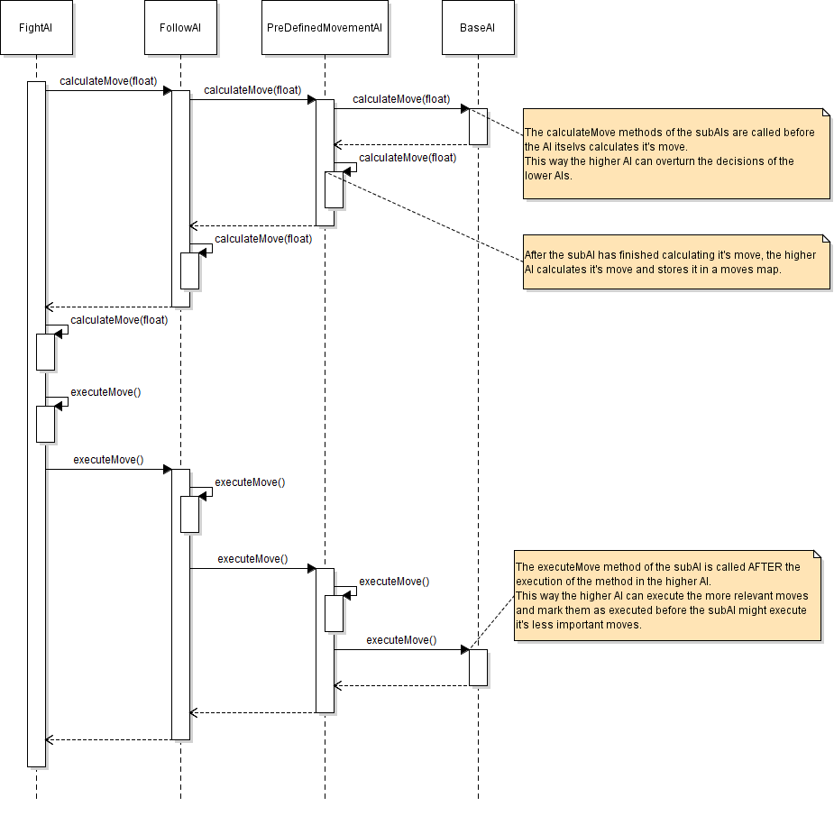
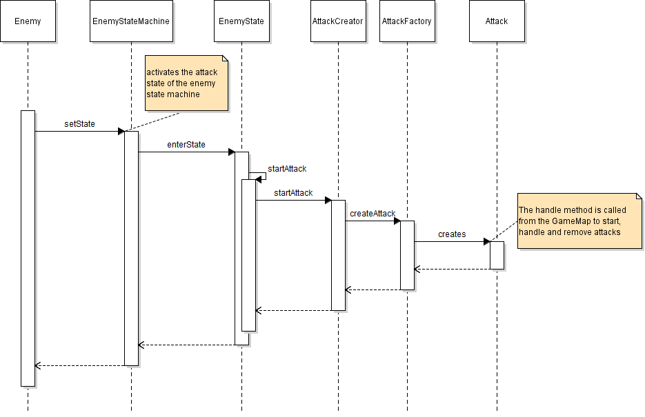
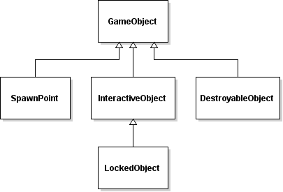
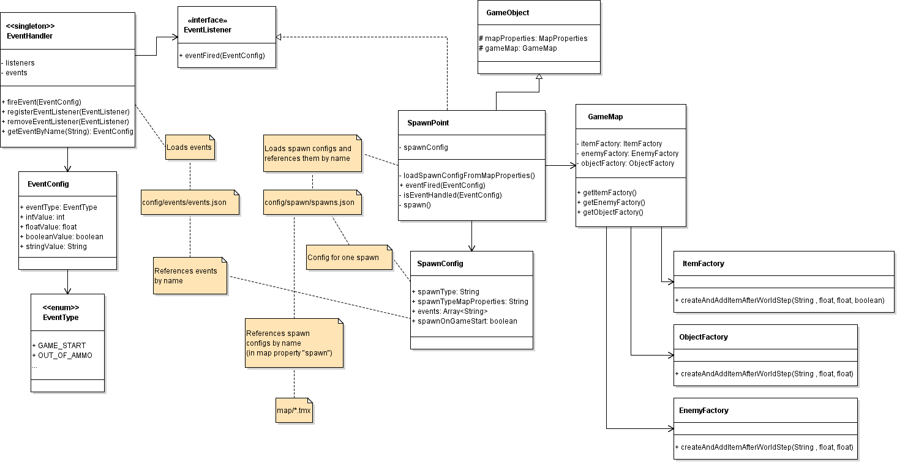

# DwarfScrollerGDX

A first test of a simple game using [libGDX](https://libgdx.badlogicgames.com/). 

The game can be played using a keyboard and a mouse or a game pad (it's optimized for game pad use).

The project uses a data-driven approach, to make it configurable and reusable for other projects. How the parts of the game can be (re-)used is described in the following sections.

## Overview

- [Structure of the game and packages](#structure-of-the-game-and-packages)
- [Globally used classes](#globally-used-classes)
- [Inputs](#inputs)
- [Enemies](#enemies)
- [NPCs](#npcs)
- [Animals](#animals)
- [Attacks](#attacks)
- [Events](#events)
- [Cutscenes](#cutscenes)
- [Conditions](#conditions)
- [Items](#items)
- [Game Objects](#game-objects)
- [Maps](#maps)
- [Saving and Loading Game States](#saving-and-loading-game-states)
- [Menus](#menus)
- [Others](#others)

## Structure of the game and packages

The structure of the libGDX project is documented by [libGDX](https://libgdx.badlogicgames.com/documentation/gettingstarted/Creating%20Projects.html). The mayority of the classes is to be found in the `core` project.

The main class of the project is the class [DwarfScrollerGame](core/src/net/jfabricationgames/gdx/DwarfScrollerGame.java), which is instantiated by the desctop project (see libGDX documentation for details). This class contains some config paths, initializes [global classes](#globally-used-classes) and sets the screen, so the execution is directed to the active screen (the first one will be the main menu).

The screens, that handle the whole game (when the screen is active), are placed in the `screens` package. Here the [GameScreen](core/src/net/jfabricationgames/gdx/screens/game/GameScreen.java) class is the central class, that is called from the libGDX engine, on every render step.

The playable character and it's movement is to be found in the `character` package. The [Dwarf](core/src/net/jfabricationgames/gdx/character/player/implementation/Dwarf.java) is the character, that is controlled by the player. The inputs, the player maked are handled in the [CharacterInputProcessor](core/src/net/jfabricationgames/gdx/character/player/implementation/CharacterInputProcessor.java), which uses the configurable input (explained in the [inputs section](#inputs)).

**Note:** All configuration json files might contain incorrect json syntax, because libGDX allows changes to the usuall json syntax, like adding comments to the files (see the [libGDX wiki documentation](https://github.com/libgdx/libgdx/wiki/Reading-and-writing-JSON) for more information)

## Globally used classes

#### AssetGroupManager

The class [AssetGroupManager](core/src/net/jfabricationgames/gdx/assets/AssetGroupManager.java) is a singleton that can be configured and is a central point to keep all assets of a game. The assets are divided into groups, because not all assets will be used in every level. An example of the configuration of the asset groups is the [asset_groups.json](core/assets/config/assets/asset_groups.json) file. The configuration file can be used to add different types of assets, with their path and optional parameters.

#### SoundManager

The class [SoundManager](core/src/net/jfabricationgames/gdx/sound/SoundManager.java) is a singleton that can be configured and used as a central point for all sound effects. The SoundManager keeps a map of sound sets, that contain sounds for different types (to get a more structured configuration of sounds). The configuration of sounds is to be found in the [sound_sets.json](core/assets/config/sound/sound_sets.json) file. The sounds can be named and parameterized with a volume (where 1 is the unchanged default volume of the file) and a delay, which causes the sound effect to be delayed when started (this is usefull e.g. for attack sound effects on attacks, where the animation first charges and then hits, so the animation and the sound can be started at the same time). An example is the `hit2` sound effect of the dwarf (in the [sound_sets.json](core/assets/config/sound/sound_sets.json) config file).

**Note:** for the configuration (volume and delay) of the sound effects to take effect the sound has to be started using the `playSound(String name)` method of the [SoundSet](core/src/net/jfabricationgames/gdx/sound/SoundSet.java). Do not use the `getSound(String name)` method unless you want to configure the sound yourself.

#### Font

The class [FontManager](core/src/net/jfabricationgames/gdx/text/FontManager.java) is a singleton that can be configured and used as a central point for all fonts, that are used in the game, to write texts to the screen. The configuration can be found in the [fonts.json](core/assets/config/font/fonts.json) file. For more information on shaders in libGDX see the [libGDX wiki](https://github.com/libgdx/libgdx/wiki/Shaders).

## Inputs

Input handling in libGDX (as described in the [libGDX wiki](https://github.com/libgdx/libgdx/wiki/Input-handling) can be used quite easy, but can not be configured as a data-driven approach. Therefore the [input package](core/src/net/jfabricationgames/gdx/input) has the possibilities to configure the inputs in an xml file, and to query the inputs by configured names. The input configuration, that is used in the game is to be found in the [profile.xml](core/assets/config/input/profile.xml) file. The use of the configuration in code can be found in the [CharacterInputProcessor](core/src/net/jfabricationgames/gdx/character/player/implementation/CharacterInputProcessor.java) class. Because not all possibilities of the input configuration are used in the game, there is a second configuration file, that includes a detailed documentation on the configuration possibilities: [demo_config.xml](core/assets/config/input/demo_profile.xml)

## Enemies

The code for the enemies is divided into several packages. The base class for every enemy in the game is the class [Enemy](core/src/net/jfabricationgames/gdx/character/enemy/Enemy.java). This class keeps track of all information of the enemeis, like their AI, the states, physics bodies and configurations. An Enemy instance is added to the map by the [TiledMapLoader](core/src/net/jfabricationgames/gdx/map/TiledMapLoader.java), which is explained in the [Maps](#maps) section. This loader uses the [EnemyFactory](core/src/net/jfabricationgames/gdx/character/enemy/EnemyFactory.java) class to create all enemies. Therefore the enemies that are mentioned in the map properties have to be added in the EnemyFactory, for the enemies to be created.

**Note:** The EnemyFactory class has to be expanded for every new enemy type that is created. The names used for the types of enemies have to be the same as referenced in the map properties.

Although parts of the enemy implementations must be designed inside the classes, some parts of the enemies are configured in a json configuration file. There is one file called [types.json](core/assets/config/enemy/types.json) for all enemy types, that keeps track of some configurations, and the configuration files, that are used to further configure the enemy's AI and states.

### Animations

The animations that an enemy can show are configured in json configuration files. These files are referenced from the [types.json](core/assets/config/enemy/types.json) configuration file. They include the animation's name (that is used to identify the animation within the texture atlas, and to reference it e.g. from the states), the atlas that is used to store the images, the frame duration for each of the images in the animation and the play mode. An example for such a file is the [gladiator.json](core/assets/config/animation/enemy/gladiator.json) file.

### AI

Most enemies act slightly different, but have many things in common. But not all enemies will make use of all types of AIs. There might be AI's that follow the player, while others just stand still and throw things at the player. Therefore the AI of the enemies is designed, using a [decorator pattern](https://en.wikipedia.org/wiki/Decorator_pattern) and a [chain of responsibility pattern](https://en.wikipedia.org/wiki/Chain-of-responsibility_pattern).

#### Configuration

Most AIs can be configured to define their behavior without writing code. The configuration is done in configuration files, that are referenced in the main enemy type configuration file [types.json](core/assets/config/enemy/types.json). If an AI configuration file is configured for the enemy type, the file is loaded by the enemy class and converted into an [EnemyAiConfig](core/src/net/jfabricationgames/gdx/character/ai/config/AiConfig.java), that includes a map of named AI types. Which of the AI types is chosen for an instance can be configured in the map properties of the enemy. If nothing is configured in the map properties, the default value, that is configured in the [EnemyAiConfig](core/src/net/jfabricationgames/gdx/character/enemy/ai/config/EnemyAiConfig.java) object is used. The type configurations can be parsed to an [ArtificialIntelligenceConfig](core/src/net/jfabricationgames/gdx/character/ai/ArtificialIntelligenceConfig.java). The field `type` of this class is a value of the enum [ArtificialIntelligenceType](core/src/net/jfabricationgames/gdx/character/ai/ArtificialIntelligenceType.java). These enum constants are then used to build the AI from the `ArtificialIntelligenceConfig` object.

Most enemy types can be configured in these files, because they use the common AI types. Some enemies are to specialized to be build by a configuration file. The AI of these enemies is created in the code. An example for a class that creates it's AI in the code is [Minotaur](core/src/net/jfabricationgames/gdx/character/enemy/implementation/Minotaur.java).  
**Note:** A subclass of Enemy, that defines it's AI in the class code needs to be added to the [EnemyFactory](core/src/net/jfabricationgames/gdx/character/enemy/EnemyFactory.java) code, to load the correct class when instantiating the enemy.

An example of an enemy type that is configured is the Gladiator, whichs AI configuration looks like this:

```javascript
{
	defaultAI: gladiator,
	aiConfigurations: {
		gladiator: {
			type: FIGHT_AI,
			
			stateNameAttack: attack,
			
			attackTimerConfig: {
				type: FIXED,
				fixedTime: 1f,
			},
			attackDistance: 1.25f,
			
			subAI: {
				type: FOLLOW_AI,
				
				stateNameMove: move,
				stateNameIdle: idle,
				
				subAI: {
					type: PRE_DEFINED_MOVEMENT_AI,
					
					stateNameMove: move,
					stateNameIdle: idle,
					
					useRelativePositions: true,
					
					subAI: {
						type: BASE_AI,
					}
				}
			}
		}
	}
}
```
The enemy AI configuration contains only one AI, that is build of a [BaseAI](core/src/net/jfabricationgames/gdx/character/ai/BaseAI.java), that is surrounded by a [PreDefinedMovementAI](core/src/net/jfabricationgames/gdx/character/ai/implementation/PreDefinedMovementAI.java), surrounded by a [FollowAI](core/src/net/jfabricationgames/gdx/character/ai/implementation/FollowAI.java), surrounded by a [FightAI](core/src/net/jfabricationgames/gdx/character/enemy/ai/FightAI.java). 

These AI's will cause the following behaviour for the Gladiator:
- The [BaseAI](core/src/net/jfabricationgames/gdx/character/ai/BaseAI.java) is (obviously) the base for all AIs, because the chain has to end somewhere.
- The [PreDefinedMovementAI](core/src/net/jfabricationgames/gdx/character/ai/implementation/PreDefinedMovementAI.java) will make the gladiator move along a pre-defined way (defined in the map properties), as long as there is no higher AI, that says something else
- The [FollowAI](core/src/net/jfabricationgames/gdx/character/ai/implementation/FollowAI.java) will make the gladiator follow the player if he is in range (and detected by the enemies box2d sensor). This AI is positioned higher as the PreDefinedMovementAI in the chain of responsibility. Therefore the gladiator will priorize following the player higher than moving along his pre-defined way.
- The [FightAI](core/src/net/jfabricationgames/gdx/character/enemy/ai/FightAI.java) will make the gladiator attack the player if he is near.

The following image shows the call hierarchy of the AI classes:



### States

An enemy can be in different states, which can be interrupted by other states, or changed to other states when the state ends. Therefore the enemy states are designed as a (kind of) [state pattern](https://en.wikipedia.org/wiki/State_pattern). These states of the enemy and the transitions between the states can be configured in json configuration files. An example of a state configuration file for the gladiator is the [gladiator.json](https://github.com/tfassbender/DwarfScrollerGDX/blob/master/core/assets/config/enemy/states/gladiator.json) file. It defines a list of states, that are identified by their id. The states may define the following attributes:

- **id:** A string to identify the state (within this enemy the id has to be unique).
- **animation:** The animation that is to be played in the state. The animation references the animation name, that is defined in the animation config file, for this enemy. For the gladiator this configuration file is the [gladiator.json](core/assets/config/animation/enemy/gladiator.json) file. The animation will be started when the state is entered.
- **attack:** An attack, that is executed when entering the state. The name references an attack from the attack configuration file. See the [Attacks](#attacks) section for more details on attacks.
- **endsWithAnimation:** Defines whether the state ends when the animation of this state is over. If set to true a **followingState** has to be defined.
- **followingState:** Defines the state that will follow after this state ends (only used if **endsWithAnimation** is set to true).
- **interruptingStates:** A list of states, that can interrupt this state. If a state that is not defined in this list tries to interrupt this state, the state will not be changed. Examples for this list would be an `idle` state, which usually can be interrupted by every other state, or a `die` state, which probably can't be interrupted by any other state (see the [gladiator.json](core/assets/config/animation/enemy/gladiator.json) config file).
- **flipAnimationToMovingDirection:** Indicates whether the animation images of this state should be flipped to follow the moving direction (e.g. for the `move` state, so the enemy will not run backwards). The default value of this property is `true`.
- **flipAnimationOnEnteringOnly:** Indicates whether the animation should be flipped to the current direction, only once when entering the state. This can be usefull e.g. for the `die` state, because the direction of this animation usually doesn't change.

## NPCs

NPCs can be all types of characters. They are similar to [Enemies](#enemies), except that they are restricted and can not attack the player or other enemies. In addition to the other enemy functionalities, the player can interact with NPCs by moving close to them and clicking the interact button (just like he would interact with [Interactive Objects](#interactive-objects)).

Since there can be many NPCs in a game, the configuration files [types.json](core/assets/config/npc/types.json) defines a map of all NPCs and their configuration file. An example of an NPC configuration file is [adventurer.json](core/assets/config/npc/adventurer.json):

```javascript
{
	graphicsConfigFile: config/npc/graphics/adventurer.json
	 
	aiConfig: {
		type: PRE_DEFINED_MOVEMENT_AI,
		
		stateNameMove: move,
		stateNameIdle: idle,
		
		useRelativePositions: true,
		
		subAI: {
			type: BASE_AI,
		}
	},
	
	interactionPossible: true,
	movingSpeed: 1f,
	
	interactionEventId: adventurer,
}
```

The NPC's main configuration file references a `graphicsConfigurationFile`, because many NPCs can use one graphics configuration, but define different behaviors. The NPCs behavior is defined in the `aiConfig` field, that defines the build up of an AI like explained in the [AI](#ai) section of the [Enemies](#enemies) description. The `interactionEventId` defines the event parameter, that is added to the [Event](#events), that is fired when the player interacts with the NPC. The [EventType](core/src/net/jfabricationgames/gdx/event/EventType.java) of the event is `NPC_INTERACTION`. These events can be consumed by the [GlobalEventListener](core/src/net/jfabricationgames/gdx/event/global/GlobalEventListener.java), if they are defined in a global event listener config file, that is referenced by the main global event config file [globalListenedEvents.json](core/assets/config/events/globalListenedEvents.json).

## Animals

Animals are similar to [Enemies](#enemies) or [NPCs](#npcs). They are restricted to not attack nor interact with the player. The animal types are defined in the json config file [types.json](core/assets/config/animals/types.json). This configuration file defines a map of configurations of the type [AnimalTypeConfig](core/src/net/jfabricationgames/gdx/character/animal/AnimalTypeConfig.java).

The animals can be configured to use [states](#states) and an [AI](#ai) like [Enemies](#enemies) and [NPCs](#npcs). The AIs can be configured to make the animals move around, switch to multiple idle states or change to specified states when the player gets near. An example for an animal's AI configuration can be found in the configuration file [squirrel.json](core/assets/config/animals/ai/squirrel.json).

```javascript
{
	defaultAI: squirrel,
	aiConfigurations: {
		squirrel: {
			type: RUN_AWAY_AI,
			
			distanceToKeepFromPlayer: 3f,
			distanceToStopRunning: 0f,
			
			stateNameMove: move,
			stateNameIdle: idle,
			
			subAI: {
				type: RANDOM_IDLE_STATES_MOVEMENT_AI,
				
				useRelativePositions: true,
			
				stateNameMove: move,
				stateNameIdle: idle,
			
				movementProbability: 0.15f,
			    maxMoveDistance: 4f,
				distanceToKeepFromPlayer: 3f,
				
				idleStates: {
					idle: {
						probability: 0.6,
					},
					idle_2: {
						probability: 0.2,
					},
					dig: {
						probability: 0.1,
						minRepetitions: 5,
						maxRepetitions: 10,
					},
					eat: {
						probability: 0.1,
						minRepetitions: 10,
						maxRepetitions: 15
					}
				}
				
				subAI: {
					type: BASE_AI,
				}
			}
		}
	}
}
```

This configuration file defines the AI of the squirrel, that moves around, or changes to multiple idle states randomly and runs away if the player gets to close to it.

## Attacks

Attacks are used to add a hit fixture to the enemy body. Hit fixtures are Box2D sensors, that apply damage to the player, enemies or objects, when colliding. The attacks are usually referenced from the player's or enemy's states and are executed as soon as a state is entered. An example file, that defines the attacks of an enemy is the [spider.json](core/assets/config/enemy/attack/spider.json) file. The possible attributes are:

- **id:** A string to identify the attack (and reference it form the states configuration).
- **type:** An [AttackType](core/src/net/jfabricationgames/gdx/attack/AttackType.java), that is used to differ between different attack (like melee attacks and projectile attacks)
- **delay:** A delay (in seconds) before the attack starts. This can be usefull, because the animation may show the enemy charging before actually attacking, so the attack appears in the correct moment.
- **duration:** Defines how long the hit fixture will stay active before being removed. The default value is `0`, which leads to the hit fixture being added for only one render step.
- **damage:** The damage that the attack will deal to the player.
- **distFromCenter:** The distance, that the hit fixture will have from the center of the enemies body (in the direction of the attack).
- **hitFixtureRadius:** The radius of the hit fixture.
- **pushForce:** The force whith which the player will be pushed back when hit by the attack.
- **pushForceAffectedByBlock:** Defines whether the push force can be lowered by the players shield.
- **explosionDamage:** The damage that is dealt by a projectile attack, that creates an explosion (like bombs).
- **explosionPushForce:** The push force of an explosion, that is created by a projectile attack.
- **explosionPushForceAffectedByBlock:** Defines whether the push force of an explosion, that is created by a projectile attack, can be lowered by the players shield.

There are several types of attacks, but they can be divided into two classes: **Melee Attacks** and **Projectile Attacks**

### Melee Attacks

Melee Attacks are quite simple attacks. They create a hit fixture (a Box2D sensor, with a mask to hit the targeted objects / enemies) that is created near the executing character (a player, an enemy, ...) and deals a defined damage to the target if a collision is found by Box2D. Melee attacks are executed in the [MeleeAttack](core/src/net/jfabricationgames/gdx/attack/MeleeAttack.java) class. For the configuration of attacks see [Attacks](#attacks).

### Projectile Attacks

Projectile Attacks are attacks that don't just create a hit fixture, that deals damage, but create a projectile that moves in the map like a new map object. A projectile attack is created using the [ProjectileAttack](core/src/net/jfabricationgames/gdx/attack/ProjectileAttack.java) class, that creates a [Projectile](core/src/net/jfabricationgames/gdx/projectile/Projectile.java). This projectile behaves like a Game Object but also like an attack. Because all projectiles can show very different behavior there are multiple projectile subclasses like [Arrow](core/src/net/jfabricationgames/gdx/projectile/Arrow.java) (a quite simple projectile that moves in a straight line and deals damage), [Bomb](core/src/net/jfabricationgames/gdx/projectile/Bomb.java) (a projectile that waits some time before exploding, which creates an explosion. The explosion is also a projectile) or [Web](core/src/net/jfabricationgames/gdx/projectile/Web.java) (a projectile that deals damage to the player and slows him down if he's in it's range).

### Creating Attack Objects

Attacks can be created using an [AttackCreator](core/src/net/jfabricationgames/gdx/attack/AttackCreator.java) instance. Every object that is able to attack others (usually an enemy or a player) has an instance of an AttackCreator, that keeps track of all the attacks of the object. It can be used to start attacks by it's startAttack methods that take the name of the attack, the direction and optionally the Box2D [PhysicsCollisionType](core/src/net/jfabricationgames/gdx/physics/PhysicsCollisionType.java) to create an attack using an [AttackFactory](core/src/net/jfabricationgames/gdx/attack/AttackFactory.java). After creating the Attack, the AttackCreator keeps the attacks, handles them and removes them after they are over.

The attacks that can be used are defined in configuration files, that are given to the AttackCreator as constructor parameters. These configuration files define all attacks of the attacking object as a list of [AttackConfig](core/src/net/jfabricationgames/gdx/attack/AttackConfig.java) objects, that define the behaviour of the attack. An example for an attack configuration file is [minotaur.json](core/assets/config/enemy/attack/minotaur.json). The attacks, that are configured in these files can be created in the AttackCreator and are referenced by their **id**.

The call hierarchy, that is used to create an attack (from an enemy object) is shown in the diagram below:



## Events

The event handling system of the game uses a singleton class [EventHandler](core/src/net/jfabricationgames/gdx/event/EventHandler.java) that is used for firing events and substribing [EventListener](core/src/net/jfabricationgames/gdx/event/EventListener.java)s. The events that are fired are [EventConfig](core/src/net/jfabricationgames/gdx/event/EventConfig.java) objects, that define the type of the fired event as a value of the [EventType](core/src/net/jfabricationgames/gdx/event/EventType.java) enum and other parameters.

### Configured Events

Some events are configured in the configuration file [events.json](core/assets/config/events/events.json). These events are fired from the code on specific events (e.g. the game is started). And can be received from game objects, that can be configured in the map (see [Spawn Points](#spawn-points)).

### Global Events

Events that are not created in code, but in configuration (e.g. when touching an event object on the map) can be handled by the [GlobalEventListener](core/src/net/jfabricationgames/gdx/event/global/GlobalEventListener.java). This EventListener listens to all fired events and compares them to the event config of the events, that are configured in a global event configuration file, that is referenced from the JSON file [globalListenedEvents.json](core/assets/config/events/globalListenedEvents.json). If they match, the event is executed (e.g. to show a text on the screen when the player reaches a position or picks up a special item. See [Event Items](#event-items) and [Event Objects](#event-objects)). The *executionType*, that is configured in the global events is a value of the [GlobalEventExecutionType](core/src/net/jfabricationgames/gdx/event/global/GlobalEventExecutionType.java) enum, that defines how the event is to be executed.

### Conditional Events

Global events can be executed only under given conditions. See [Conditions in Events](#conditions-in-events) for more details.

## Cutscenes

Cutscenes can be used for special, predefined scenes, in which neither the player nor other game objects (like enemies) have control over what is happening. The complete situation is only managed by the cutscene. This can be useful for interactions with NPCs, or to introduce a boss fight.

All cutscenes, that are configured in the game, need to be configured in an own file (which is usually placed in the [config/cutscene](core/assets/config/cutscene) directory. The json config file [cutscenes.json](core/assets/config/cutscene/cutscenes.json) is a special file in this directory, that has to be placed there with exactly this name. It defines a list of all other cutscene configuration files as a json-array.

### Configuring Cutscenes

An example of a cutscene configuration file is [minotaur_cutscene.json](core/assets/config/cutscene/demo/minotaur_cutscene.json). It defines an `id`, which is the name that can be used to attain the cutscene, and a map named `controlledActions`, which defines the actions of the cutscene.  
The actions, defined in the `controlledActions` map are a key value pairs, that map a name of the action to a [CutsceneControlledActionConfig](core/src/net/jfabricationgames/gdx/cutscene/CutsceneControlledActionConfig.java) object, that defines how this action of the cutscene is to be interpreted and executed.

Another example of a cutscene configuration file is [talk_to_female_adventurer.json](core/assets/config/cutscene/demo/talk_to_female_adventurer.json). This configuration does not include unit or camera movement, but conditions and player choices. See [Conditions in Cutscenes](#conditions-in-cutscenes) for more information.

A [CutsceneControlledActionConfig](core/src/net/jfabricationgames/gdx/cutscene/CutsceneControlledActionConfig.java) defines the following parameters:

- **type:** A [CutsceneControlledActionType](core/src/net/jfabricationgames/gdx/cutscene/CutsceneControlledActionType.java) that defines how the action is executed.
- **executes:** The actions that are executed after this action ends. The actions are referenced by their names.
- **startsWithCutscene:** A boolean flag, that defines whether this action should be started immediately when the cutscene is started. Each cutscene has to define exactly one action, that starts with the cutscene. The default value of this property is false.
- **executionDelayInSeconds:** Defines the time that is waited before starting the action. The default value is 0.
- **event:** An [EventConfig](core/src/net/jfabricationgames/gdx/event/EventConfig.java) that is executed by the cutscene.
- **globalEvent:** A String value that is added to an [EventConfig](core/src/net/jfabricationgames/gdx/event/EventConfig.java) that is fired, when this action is executed. The [EventType](core/src/net/jfabricationgames/gdx/event/EventType.java) of the EventConfig that is fired is `CUTSCENE_EVENT`. This event can be registered by the [GlobalEventListener](core/src/net/jfabricationgames/gdx/event/global/GlobalEventListener.java) that handles the event (see [Global Events](#global-events) for more details on how global events work).
- **waitForEventToFinish:** A boolean flag, that defines whether the execution of this action should wait for the fired event to be finished. This will only work for events that show text on the screen. The event (and this action) then end as soon as the text on the screen is confirmed by the user. For other events this will not work, but wait infinitely.
- **choice:** A [PlayerChoice](core/src/net/jfabricationgames/gdx/condition/choice/PlayerChoice.java) that shows a textbox with different options from which the player can choose.
- **choiceExecutionOptions:** A list of Strings that define which following `CutsceneControlledActionConfig` will be executed, depending on which option the player chooses. For `CutsceneControlledActionConfig`s that use the type `PLAYER_CHOICE`, this parameter replaces the **executes** parameter.
- **condition:** A [ConditionalExecution](core/src/net/jfabricationgames/gdx/condition/execution/ConditionalExecution.java), that defines which `CutsceneControlledActionConfig` will be executed next, depending on the result of the condition. See [Conditions in Cutscenes](#conditions-in-cutscenes) for more information.
- **conditionOptionExecutions:** A map of strings, that map the configured condition result, to the name of the `CutsceneControlledActionConfig` that will be executed if the condition is met. See [Conditions in Cutscenes](#conditions-in-cutscenes) for more information.
- **executionParameters:** Parameters for the execution of generated global events (used to create `SHOW_ON_SCREEN_TEXT` events).
- **controlledUnitId:** The id of a unit, that is controlled by this cutscene. This id needs to match a `unitId` of a unit in the current game map. The unit id is added to the map object with the parameter `unitId` in the map properties. The player character can always be reached by the unit id `PLAYER`.
- **controlledUnitState:** The state to which a controlled enemy is changed. This parameter has to match a state that is defined in the enemy's config file (see [Enemy States](#states)).
- **controlledUnitAttackTargetDirection:** A direction vector to which the attack of a unit is directed (if the state to which was changed is an attack state).
- **controlledUnitTarget:** The target to which the controlled unit is moved. The movement is always relative to the target unit (one of the next parameters).
- **speedFactor:** The speed with witch the unit is moved (relative to the normal speed of this unit). The default is 1f, which means the unit moves as fast as usual.
- **targetPositionRelativeToUnitId:** The id of a unit that is the relative target point for the controlledUnitTarget (one of the previous parameters).
- **updatePositionRelativeToTarget:** A boolean flag, that defines whether target position of the controlled unit is to be updated, relative to the targetPositionRelativeToUnitId parameter. This can be useful if the relative target is also moving. The default is false.
- **cameraFollowsTarget:** A boolean flag, that defines whether the camera has to follow the current controlled unit. If this parameter is set to false the camera will only move if it is moved by this cutscene. The default value is false.

### Activating Cutscenes

Cutscenes are usually started by a [Global Event](#global-events), that's type is set to `START_CUTSCENE`. The global event has to be configured to be activated when the cutscene is meant to be started. A cutscene that is configured to be started when the player touches an event object on the map is configured in the [demo.json](core/assets/config/events/global/demo.json) config file (that is a config file for global listened events, which is referenced from the main config file [globalListenedEvents.json](core/assets/config/events/globalListenedEvents.json)):

```javascript
{
  //...
  demoLevel_startCutscene: {
    event: {
      eventType: EVENT_OBJECT_TOUCHED,
      stringValue: demoLevel_startCutscene,
    },
    executionType: START_CUTSCENE,
    executionParameters: {
      cutsceneId: demoLevelCutscene,
    }
  },
  //...
}
```

## Conditions

Conditions can be used to add conditional executions to the game (e.g. the text of an interaction with an NPC, that changes if the player has completed a quest). The conditions can be configured in the configuration json file: [conditions.json](core/assets/config/condition/conditions.json).

The condition names have to be unique to be correctly loaded [ConditionHandler](core/src/net/jfabricationgames/gdx/condition/ConditionHandler.java), where the conditions can be checked by calling the `checkCondition(String)` method, with the id of the condition that is to be checked. The method returns whether the condition is met or not (by returning a boolean).  
The conditions can be configured with the following parameters:

- **conditionType:** The type of the condition, that determines how the condition is executed. The type has to be one of the enum constants of the enum [ConditionType](core/src/net/jfabricationgames/gdx/condition/ConditionType.java). This parameter is mandatory.
- **parameters:** A map of String parameters, that can be used in the check of the condition in the [ConditionType](core/src/net/jfabricationgames/gdx/condition/ConditionType.java) enum.
- **conditionalParameters:** A map of [Condition](core/src/net/jfabricationgames/gdx/condition/Condition.java) parameters, to define concatenated conditions (using the concatenations `AND`, `OR` or `NOT` of the [ConditionType](core/src/net/jfabricationgames/gdx/condition/ConditionType.java) enum).

### Conditions in Events

To actually use the conditions that are defined in the [conditions.json](core/assets/config/condition/conditions.json) file, they can be used in events (see [Events](#events) for more information on events). To be used in [Global Events](#global-events), the conditions need to be added to the configuration json file [globalListenedEvents.json](core/assets/config/events/globalListenedEvents.json). An example of a conditional global event is the global event `demoLevelChangeToNextMap`, that is defined in [globalListenedEvents.json](core/assets/config/events/globalListenedEvents.json):

```javascript
{
  //...
  demoLevelChangeToNextMap: {
    event: {
      eventType: EVENT_OBJECT_TOUCHED,
      stringValue: go_to_map_4,
    },
    executionType: CONDITIONAL_EVENT,
    condition: {
      conditionId: demoLevel_endItemCollected,
      thenCase: {
        type: EVENT,
        eventConfig: {
          executionType: CHANGE_MAP,
          executionParameters: {
            map: test_map_4,
          }
        }
      },
      elseCase: {
        type: NO_EXECUTION,
      }
    }
    executionParameters: {
      map: test_map_4,
    }
  },
  //...
}
```

In this conditional, global event the `event` parameter, defines what is needed to execute the event (see [Global Events](#global-events), that decides what will be executed, based on the condition. The `executionType` of the event has to be `CONDITIONAL_EVENT`, for the event to be executed as conditional event. The `condition` parameter defines a [ConditionalExecution](core/src/net/jfabricationgames/gdx/condition/execution/ConditionalExecution.java), that contains a `conditionId` (which is a String parameter), a `thenCase` and an `elseCase` (which both are [ConditionExecutable](core/src/net/jfabricationgames/gdx/condition/execution/ConditionExecutable.java) objects).   
The `conditionId` references the name of a condition, that was defined in a configuration file, that is referenced by the main configuration file for conditions: [conditions.json](core/assets/config/condition/conditions.json). Whenever the event is executed, it checks the defined condition and then executes either the `thenCase` (if the condition is met) or the `elseCase` (if the condition is not met).  
The `thenCase` and the `elseCase` are both [ConditionExecutable](core/src/net/jfabricationgames/gdx/condition/execution/ConditionExecutable.java) objects, that need to have a `type` parameter that references an enum constant of the [ConditionExecutableType](core/src/net/jfabricationgames/gdx/condition/execution/ConditionExecutableType.java) enum.  
The [ConditionExecutable](core/src/net/jfabricationgames/gdx/condition/execution/ConditionExecutable.java) type again defines parameters, that can be used to fire events, for cascading [ConditionalExecution](core/src/net/jfabricationgames/gdx/condition/execution/ConditionalExecution.java)s or for other executions.  
If a case must not be executed it can't be left out, but needs to be defined with a `NO_EXECUTION` type, like the `elseCase` in the example above.

### Conditions in Cutscenes

In cutscenes there are two types of conditions, that can be configured. The first type is similar to the conditions that can be added to events. The following example shows a condition from the cutscene configuration file [talk_to_female_adventurer.json](core/assets/config/cutscene/demo/talk_to_female_adventurer.json):

```javascript
{
  //...
  answer_right: {
    type: CONDITION,
    
    condition: {
      conditionId: demoLevel_endItemCollected,
      thenCase: {
        type: CUTSCENE,
        executionParameters: {
          conditionCase: condition_met,
        }
      },
      elseCase: {
        type: CUTSCENE,
        executionParameters: {
          conondition_not_met,
        }
      }
    },
    conditionOptionExecutions: {
      condition_met: answer_condition_met,
      condition_not_met: answer_condition_not_met,
    },
    
    waitForEventToFinish: true,
  },
  //...
}
```

In this [CutsceneControlledActionConfig](core/src/net/jfabricationgames/gdx/cutscene/CutsceneControlledActionConfig.java) the type `CONDITION` shows that this action config is to be executed as a [CutsceneConditionAction](core/src/net/jfabricationgames/gdx/cutscene/action/CutsceneConditionAction.java).   
The `condition` parameter defines a [ConditionalExecution](core/src/net/jfabricationgames/gdx/condition/execution/ConditionalExecution.java), that contains a `conditionId` (which is a String parameter), a `thenCase` and an `elseCase` (which both are [ConditionExecutable](core/src/net/jfabricationgames/gdx/condition/execution/ConditionExecutable.java) objects).   
The `conditionId` references the name of a condition, that was defined in a configuration file, that is referenced by the main configuration file for conditions: [conditions.json](core/assets/config/condition/conditions.json).

To be used in cutscenes, the type of the `thenCase` and `elseCase` need to be `CUTSCENE`, to notify the active cutscene about the result of the condition. It is also possible to configure the type `CONDITION` to define cascading conditions with more than two possible results. Here the final case still has to use the type `CUTSCENE`. The `executionParameters` define a map of strings. Here the key `conditionCase` has to be used and mapped to a unique string value. This string value is then used as key in the `conditionOptionExecutions` map, that maps it to the name of the next [CutsceneControlledActionConfig](core/src/net/jfabricationgames/gdx/cutscene/CutsceneControlledActionConfig.java), that is executed, depending on the result of the condition.

In the example above this means, that if the condition with the conditionId **demoLevel_endItemCollected** is met (the condition is defined in a condition configuration file), the string **condition_met** will be sent to the cutscene, which causes the execution of the next cutscene action: **answer_condition_met**.

The second type of condition, is a [PlayerChoice](core/src/net/jfabricationgames/gdx/condition/choice/PlayerChoice.java). This condition creates a textbox on the screen, that shows options from which the player can choose. An example of such a condition is the following (taken from the configuration file [talk_to_female_adventurer.json](core/assets/config/cutscene/demo/talk_to_female_adventurer.json).

```javascript
{
  //...
  answer: {
    type: PLAYER_CHOICE,
    
    waitForEventToFinish: true,
    
    choice: {
      header: "Dwarf",
      headerColor: #0000FF
      description: "What do you want to answer?"
      options: [
        "Whasuuuuuuuup?",
        "General Kenobi..."
      ],
    },
    choiceOptionExecutions: [
      answer_wrong,
      answer_right,
    ]
  },
  //...
}
```

In the example above the type `PLAYER_CHOICE` defines, that the [CutsceneControlledActionConfig](core/src/net/jfabricationgames/gdx/cutscene/CutsceneControlledActionConfig.java) is to be executed as a [CutscenePlayerChoiceAction](core/src/net/jfabricationgames/gdx/cutscene/action/CutscenePlayerChoiceAction.java). The `choice` parameter is a [PlayerChoice](core/src/net/jfabricationgames/gdx/condition/choice/PlayerChoice.java), that is used to define the header, the header color, a description text and up to three options that the user can pick. These are shown in a textbox on the screen.  
The list `choiceOptionExecutions` defines the list of possible next [CutsceneControlledActionConfig](core/src/net/jfabricationgames/gdx/cutscene/CutsceneControlledActionConfig.java)s that can be executed, based on the players choice. If the player chooses the first option, the first entry from the `choiceOptionExecutions` list will be chosen. If the player chooses the second option, the second entry from the list will be chosen...

## Items

### Adding Items

Items are usually added to the game from the map properties, where they can be defined and configured using the map object properties. To add an item to the map, an object has to be added to the objects layer of the map and named `item.item_name` where *item_name* is the name of an item, that is configured in the item configuration json file: [types.json](core/assets/config/items/types.json). The fields that can be configured in the json configuration file are:

- **texture:** The texture that will be used for the item.
- **animation:** The animation that will be used for the item.
- **physicsObjectRadius:** The radius of the item's physics body (default is 0.1).
- **pickUpSoundName:** The sound that will be played when the item is picked up by the player. The name references a sound, that is configured in the sound set config file [sound_sets.json](core/assets/config/sound/sound_sets.json) under the *item* sound set.

The properties that an item has, can be configured in the map, using the custom properties of an object.

### Dropping Items

Game objects and enemies can drop items at any time. What items they do drop can be defined either in the type config files [config/objects/types.json](core/assets/config/objects/types.json) and [config/enemy/types.json](core/assets/config/enemy/types.json), or in the map properties of every object that is added to the map, by using the map property key *drops*. The drop types, that are configured in the type config files define the default, that is used if no *drops* are configured in the map properties. Both configurations use a key-value map in JSON format, that defines the names of the items, that can be dropped, mapped to the probability to drop this item.  
The following example from the object type config file [types.json](core/assets/config/objects/types.json) shows a drop config, that has a 50% probability of dropping a *coin* item, a 20% probability of dropping a *big_coin* item and a 10% probability of dropping an *arrow* item:


```javascript
{
  barrel: {
    // ...
    drops: {
      coin: 0.5,
      big_coin: 0.2,
      arrow: 0.1,
    }
    
    //...
  },
  //...
}
```

The items are dropped onto the map using the [ItemDropUtil](core/src/net/jfabricationgames/gdx/item/ItemDropUtil.java) class, that defines the static method `dropItems(ObjectMap<String, Float>, GameMap, float, float, boolean)` to randomly choose an item from the map and drop it at a position on the map.

To drop a special item (like a special key to open a door), a different configuration must be used, because the normal drop items can't have special map properties. To drop special items the dropping object or enemy has to define the map property keys *specialDropType* (which defines the item type that is dropped by it's name) and *specialDropMapProperties* (which defines the map properties of the dropped object in JSON representation).

### Event Items

Event items are special types of items, that fire an event when picked up. The event type is an 'EVENT_ITEM_PICKED_UP' object from the [EventType](core/src/net/jfabricationgames/gdx/event/EventType.java) enum. The string parameter can be configured in the map properties of the event item. The parameter object of the event is the picked up item itself. Usually these events are handled by the [GlobalEventListener](core/src/net/jfabricationgames/gdx/event/global/GlobalEventListener.java), whichs events are configured in the [globalListenedEvents.json](core/assets/config/events/globalListenedEvents.json) config file. See [Events](#events) for more details.

## Game Objects

Game objects are usually added to the game from the map properties, just like items. Unlike items, game objects don't have custom properties, but define the customizable properties for every object type in the configuration json file: [types.json](core/assets/config/objects/types.json). In this file all types of objects can be configured using the following properties:

- **Config for all Game Objects**
  - **type:** The [GameObjectType](core/src/net/jfabricationgames/gdx/object/GameObjectType.java) of this object.
  - **texture:** The name of the texture that is shown for the game object.
  - **animationHit:** The animation that is shown when the player hits a game object.
  - **hitSound:** The sound that is played when the player hits the object. The name references a sound from the sound config file [sound_sets.json](core/assets/config/sound/sound_sets.json), under the *object* sound set.

  - **physicsBodySizeFactorX:** The size factor of the physics body in x direction (where *1* would be the whole size of the texture).
  - **physicsBodySizeFactorY:** The size factor of the physics body in y direction (where *1* would be the whole size of the texture).
  - **physicsBodyOffsetFactorX:** The offset factor of the physics body in x direction (where *0* would be the left edge of the texture).
  - **physicsBodyOffsetFactorY:** The size factor of the physics body in x direction (where *0* would be the bottom edge of the texture).
  - **isSensor:** Defines whether the whole body of the object should be a sensor.
  - **addSensor:** Defines whether a sensor is to be added to the body.
  - **sensorRadius:** Defines the radius of the sensor that might be added to the body.
  
  - **initAction:** A value from the [GameObjectAction](core/src/net/jfabricationgames/gdx/object/GameObjectAction.java) enum, that is executed after the game object was added to the map.

  - **drops:** The items that the object may drop. See [Dropping Items](#dropping-items) for more details.
  - **dropPositionOffsetX:** The offset to change the position where items will be dropped.
  - **dropPositionOffsetY:** The offset to change the position where items will be dropped.
  - **renderDropsAboveObject:** Defines whether dropped items will be rendered above the object or underneath it.

- **Config for Destroyable Objects**
  - **animationBreak:** The animation that is shown when the player breaks a game object (like a barrel or a wooden box).
  - **destroySound:** The sound that is played when the player destroys the object. The name references a sound from the sound config file [sound_sets.json](core/assets/config/sound/sound_sets.json), under the *object* sound set.
  - **health:** The initial health points of the object.
  - **requiredAttackType:** An [AttackType](core/src/net/jfabricationgames/gdx/attack/AttackType.java) that is needed to damage this object. Only this attack type or a subtype of this type will be able to deal damage to the object. The default is *AttackType.ATTACK*, which means that all attacks will damage the object.

- **Config for InteractiveObjects**
  - **animationAction:** The animation that is shown when the object's action is executed (e.g. opening a chest).
  - **textureAfterAction:** The texture that will be used after the execution of the action.
  - **multipleActionExecutionsPossible:** Defines whether the action can be executed multiple times or only once.
  - **hitAnimationAfterAction:** Defines whether the hit animation is still shown after the execution of the action (which could be false if a different texture is used after the execution).
  - **changeBodyToSensorAfterAction:** Defines whether the body of the object is to be changed to a sensor after the execution of the action (after the animation).
  
- **Config for LockedObjects**
  - **defaultLocked:** Defines whether a locked object's default is locked or unlocked. Changes from the default have to be defined in the map properties.

Some other properties define the Box2D physics properties (like density or friction) of the object, which usually stay to the default values.

The Game Objects are split up into multiple subclasses, for the different types of actions they can be used for. The following image shows the class structure of these classes:



### Destroyable Objects

Destroyable objects are quite simple objects, that can be destroyed by the player and usually drop some items (see [Dropping Items](#dropping-items)). They define animations for taking damage and being destroyed.

### Interactive Objects

Interactive Objects are used to let the player interact with the map. They use a sensor to find a player that is near and show an iteraction icon (a bubble with a question mark) to inform the player that an interaction is possible. They are used to display text on the screen (for dialogs with NPCs or other information) or for chests, that can be opened and drop items (see [Dropping Items](#dropping-items)).

### Locked Objects

A locked object is a special kind of [Interactive Object](#interactive-objects), that is used to lock doors or chests, so the player can't simply reach something. A *Chest* or a *Door* is not locked by default, but a *Key Wall* is locked by default (see the configuration possibilities of [Game Objects](#game-objects)). The default behaviour can be changed by a map property with the key *locked*, which needs a string value that can be converted into a `boolean`. To unlock a locked object the player has to find a key item and afterwards interact with the locked object. For normal locked objects, a normal key can be used. To unlock a special locked object a special key with the same map properties is needed. To define a special locked object (or a special key) a map property key that starts with `key_` is to be used. To match a key to a locked object the name and the value of the map property have to be equal. The properties are loaded and matched using the [KeyItem](core/src/net/jfabricationgames/gdx/character/player/container/data/KeyItem.java) class.


**Unlock by Condition:**

Locked objects can also be configured to be unlocked (and locked) by a [condition](#conditions), that is configured in the map properties of the locked object. To lock or unlock a locked object by a [condition](#conditions), the map parameter `unlockCondition` must be set to the name of a condition. So a locked object that is configured with an unlock condition `common__rune_laguz_collected` can be unlocked when a specific rune (called laguz) is collected. The condition is to be found in the configuration file [common.json](core/assets/config/condition/common.json). The locked object will not be unlocked automatically, but the player still has to interact with the locked object to unlock it (when the condition is met).


** Unlock by Event:**

Another way to configure locked objects is to configure them to be unlocked (and locked) by [events](#events). This will cause the locked object to be locked or unlocked automatically (the player doesn't need to interact with the locked object). Therefore the locked object's map properties must be configured to set the value `unlockedByEvent` to the string value `true`. Also a `lockId` must be configured, to identify the lock from the event configuration. Then one or more [event objects](#event-objects) need to be configured to execute an event, that can lock or unlock the locked object. An example can be found in the configuration file [demo.json](core/assets/config/events/global/demo.json):

```javascript
{
  //...
  demoLevel_stateSwitchesActivated: {
		event: {
			eventType: STATE_SWITCH_ACTION,
			stringValue: demoLevel_switch_group_1,
		}
		executionType: CONDITIONAL_EVENT,
		condition: {
			conditionId: demoLevel_allSwitchesActivated,
			thenCase: {
				type: EVENT,
				eventConfig: {
					executionType: OPEN_LOCK,
					executionParameters: {
						lockId: demoLevel_lock_switch_group_1
					}
				}
			}
			elseCase: {
				type: EVENT,
				eventConfig: {
					executionType: CLOSE_LOCK,
					executionParameters: {
						lockId: demoLevel_lock_switch_group_1
					}
				}
			}
		}
	},
  //...
}
```

This event is configured to unlock a locked object when the [condition](#conditions) `demoLevel_allSwitchesActivated` is met (see [event objects](#event-objects) for details on event switches). The event is triggered whenever a state switch object with the map properties `eventParameter: demoLevel_switch_group_1` is triggered. The [condition](#conditions) will check for multiple switches to be activated at the same time. The condition configuration is to be found in the configuration file [demo.json](core/assets/config/condition/levels/demo.json).

### Spawn Points

Spawn points are special Game Objects, that can be used to spawn new Items, Game Objects or Enemies. They can be added to the map, just like all other Game Objects. These objects use an Event Handling Service, that informs them on every fired event. If the event triggers a spawn, a new object is spawned on the map. The events and spawns can be configured in the json files [events.json](core/assets/config/events/events.json) and [spawnConfigs.json](core/assets/config/spawn/spawnConfigs.json). An example of a spawn config file is the file [demo.json](core/assets/config/spawn/maps/demo.json). The Spawn Points, that are added in the tiled map, have to use a map property 'spawn', that references a spawn config from the a spawn config file that is referenced by the [spawnConfigs.json](core/assets/config/spawn/spawnConfigs.json) file by name. This spawn config defines, what is to be spawned and when it is spawned.

The following image shows the connections between these config files and objects:



### Event Objects

Event Objects are game objects that can be placed on the tiled map and are added to the game map in the same size and position. These objects are not visible, but react to the player touching them. When the touch of a player is registered, the event object fires an event, that can be handled by all registered event listeners. The Type of the event is an 'EVENT_OBJECT_TOUCHED' object of the [EventType](core/src/net/jfabricationgames/gdx/event/EventType.java) enum. The string parameter of the fired event can be configured in the map properties. Usually these events are handled by the [GlobalEventListener](core/src/net/jfabricationgames/gdx/event/global/GlobalEventListener.java), whichs events are configured in the [globalListenedEvents.json](core/assets/config/events/globalListenedEvents.json) config file. See [Events](#events) for more details.

Map properties that can be configured in the event object are:

- **eventParameter:** The string parameter that will be added to the event that is fired.
- **singleExecution:** Determines whether the event can be fired only once (on the first contact with the player). The type of the parameter is a String (that will be parsed into a boolean). The default is false.
- **stateSwitchId:** Used to identify a state switch object in a condition.

**Respawn Checkpoints:**  
Respawn checkpoints are a special type of Event Objects. They are configured in the map, by adding an Event Object with the **eventParameter 'respawnCheckpoint'**. This event is received and handled by the [PlayableCharacter](core/src/net/jfabricationgames/gdx/character/player/PlayableCharacter.java) implementation [Dwarf](core/src/net/jfabricationgames/gdx/character/player/implementation/Dwarf.java).

**State Switch Objects:**

State switch objects are a special type of Event Objects. They can have two states: *active* and *inactive*. These states usually can be seen in the texture of the object. The state switch objects can execute events when the state changes (just like other event objects do, when they are triggered). In addition to the events that can be fired, the state of the switches can be checked from a [condition](#conditions). An example for a condition that uses state switches can be found in the configuration file [demo.json](core/assets/config/condition/levels/demo.json):

```javascript
{
  //...
  demoLevel_allSwitchesActivated: {
		conditionType: AND,
		conditionalParameters: {
			condition: {
				conditionType: STATE_SWITCH_ACTIVE,
				parameters: {
					stateSwitchId: demoLevel_switch_1,
				}
			},
			condition2: {
				conditionType: AND,
				conditionalParameters: {
					condition: {
						conditionType: STATE_SWITCH_ACTIVE,
						parameters: {
							stateSwitchId: demoLevel_switch_2,
						}
					},
					condition2: {
						conditionType: STATE_SWITCH_ACTIVE,
						parameters: {
							stateSwitchId: demoLevel_pressure_switch,
						}
					}
				}
			}
		}
	},
  //...
}
```

This configuration uses the state of three switches in a condition that is used to unlock a [locked object](#locked-objects). The condition is met when the state of all three state switch objects `demoLevel_switch_1`, `demoLevel_switch_2` and `demoLevel_pressure_switch` is set to *active*.

## Maps

Tiled maps are used to create a map with textures, physics and objects. Enemies, Items and game objects can be defined within the map's *objects* layer, like explained in the sections [Enemies](#enemies), [Items](#items) and [Game objects](#game-objects). Physics objects (like walls) can be defined in the physics layer of the map. **Note:** The map's physics objects have to be created by polygons with at most *8* points. The material of the physics objects must be set in the custom properties of every map object, where the key is called *material* and the name references a material name that is defined in the materials json configuration file: [materials.json](core/assets/config/map/materials.json). Within the materials configuratino file the name of the material can be defined, along with the usual box2d physics properties: *density*, *restitution* and *friction*

### Loading and Changing Maps

All maps that will be used in the game have to be configured in the json configuration file [maps.json](core/assets/config/map/maps.json). This file includes all maps, that can be loaded and used in the game, with their names and path. When the game is started, the map configuration is loaded into the [GameMapManager](core/src/net/jfabricationgames/gdx/map/GameMapManager.java), where they can be referenced by the configured name.

The map, that is configured with the `initial: true` parameter, will be the first map to be loaded when the game is started. If there are multiple maps, that are configured to be the initial map, the first one wins. To change a map the method `changeMap(String)` in the [GameScreen](core/src/net/jfabricationgames/gdx/screens/game/GameScreen.java) class is to be used. This method is private and can not be called directly. To change the map from within the game execution, an event with the [EventType](core/src/net/jfabricationgames/gdx/event/EventType.java) `CHANGE_MAP` has to be used. The following example shows a global event, that is configured to change the map, when the player touches an event object on the map:

```javascript
{
  //...
  demoLevelChangeToNextMap: {
    event: {
      eventType: EVENT_OBJECT_TOUCHED,
      stringValue: go_to_next_map,
    },
    executionType: CHANGE_MAP,
    executionParameters: {
      map: test_map_4,
    }
  },
  //...
}
```

### Global Map Properties

There are several properties that can be configured for objects on the map. The map itself has only one property that needs to be configured: **mini_map_config_path**. The value of this property is the path to the main config file of this map. This file is a JSON file that can be deserialized to a [MapConfig](core/src/net/jfabricationgames/gdx/screens/menu/config/MapConfig.java) object. An example for such a file is [tutorial.json](core/assets/config/menu/maps/tutorial.json).

### Fast Travel

Fast travel positions can be created by adding [Game objects](#game-objects) to the map (and configuring them) and configuring their use in map configuration files. The objects that need to be added to the map need to be named *object.fastTravelPoint*. The configurable map properties of these objects are:

- **fastTravelPointId:** The Id of the fast travel point which needs to be unique over all maps, to identify the fast travel point.
- **fastTravelPointName:** The name of the fast travel point that is shown to the user.
- **activeOnStartup:** A boolean flag that indicates whether the fast travel point is active when the game is started, or it needs to be activated by touching it (the default value is *false*)

The second part of configuration is done in a separate config file, that defines the UI buttons, that are used to select the fast travel points on the mini-map in the menu. This configuration is a JSON object, that maps the **fastTravelPointId**s (that reference the ones in the map object config by name) to [MenuState](core/src/net/jfabricationgames/gdx/screens/menu/control/MenuState.java) objects, that define the selection and iteraction of the fast travel points in the UI. This file needs to be referenced from the map config file. An example for such a file is [tutorial_fast_travel_states.json](core/assets/config/menu/maps/tutorial_fast_travel_states.json).

### Ground Physics

Ground physics are objects, that can be added to the ground layer of a map. These objects interact with the player, with enemies or other game objects and can be used to change the behavior of them, while touching the ground objects (e.g. the player is slowed down when he climbs up a wall or stairs). The types of ground physics have to be configured in the json configuration file [ground_types.json](core/assets/config/map/ground_types.json). The type of ground, that is applied for a map object in the ground layer is to be defined in the map properties of this map object, with the property key **ground** and a value that matches one of the configured names in the [ground_types.json](core/assets/config/map/ground_types.json) config file. 

## Saving and Loading Game States

To be able to continue the game after closing it, the game state of the game can be saved to files. Therefore all the information needed to re-create the current state of the game is serialized into a JSON file, that is stored in the file system. Therefore the class [GameDataService](core/src/net/jfabricationgames/gdx/data/GameDataService.java) can be used to to read or write game states from or to files. These files are saved in the user's home directory in the subdirectory '.DwarfScrollerGdx'.  
All data that is stored to the game save file is kept in the [GameDataHandler](core/src/net/jfabricationgames/gdx/data/GameDataHandler.java), which is a singleton object, that contains a [GameDataContainer](core/src/net/jfabricationgames/gdx/data/container/GameDataContainer.java) for the current game state. This GameDataContainer contains multiple other containers from the [container package](core/src/net/jfabricationgames/gdx/data/container) that store parts of the game state.

A serialized game state could look like the following example:

```javascript
{
"characterDataContainer": {
	"slowedDown": false,
	"health": 100,
	"maxHealth": 100,
	"increaseHealth": 0,
	"healthIncreasePerSecond": 25,
	"mana": 100,
	"maxMana": 100,
	"increaseMana": 0,
	"manaIncreasePerSecond": 25,
	"endurance": 100,
	"maxEndurance": 100,
	"increaseEndurance": 0,
	"enduranceIncreasePerSecond": 25,
	"enduranceChargeMoving": 7.5,
	"enduranceChargeIdle": 15,
	"enduranceCostsSprint": 15,
	"armor": 64.99999,
	"maxArmor": 100,
	"increaseArmor": 0,
	"armorIncreasePerSecond": 25,
	"coins": 5,
	"maxCoins": 999,
	"decreaseCoins": 0,
	"coinsDecreasePerSecond": 20,
	"respawnPoint": {
		"x": 36.45332,
		"y": 37.73332
	},
	"position": {
		"x": 40.943,
		"y": 28.140167
	}
},
"itemDataContainer": {
	"ammoArrow": 20,
	"maxAmmoArrow": 30,
	"ammoBomb": 0,
	"maxAmmoBomb": 15,
	"numNormalKeys": 1,
	"keys": [
		{
			"mapProperties": {}
		}
	],
	"specialItems": {
		"values": []
	}
},
"fastTravelDataContainer": {
	"fastTravelProperties": {
		"test_map_point_1": {
			"fastTravelPointId": "test_map_point_1",
			"fastTravelPointName": "Left",
			"enabled": false,
			"positionOnMapX": 5.72,
			"positionOnMapY": 48
		},
		"test_map_point_2": {
			"fastTravelPointId": "test_map_point_2",
			"fastTravelPointName": "Down Left",
			"enabled": true,
			"positionOnMapX": 6.3999996,
			"positionOnMapY": 6.3999996
		},
		"test_map_point_3": {
			"fastTravelPointId": "test_map_point_3",
			"fastTravelPointName": "Right",
			"enabled": false,
			"positionOnMapX": 42.239998,
			"positionOnMapY": 44.84
		},
		"test_map_point_4": {
			"fastTravelPointId": "test_map_point_4",
			"fastTravelPointName": "Down Right",
			"enabled": true,
			"positionOnMapX": 48,
			"positionOnMapY": 23.72
		}
	}
},
"mapDataContainer": {
	"mapIdentifier": "test_map_3"
},
"mapObjectDataContainer": {
	"mapObjectStates": {
		"test_map_3": {
			"states": {
				"88": {
					"state": {
						"defeated": "true",
						"droppedItems": "true",
						"__mapObjectType": "Enemy"
					}
				},
				"__not_configured_in_map__key__enemy_dropped_key": {
					"state": {
						"picked": "true",
						"position": "{\nx: 947.7061\ny: 746.1159\n}",
						"mapProperties": "\"{key_key: enemy dropped key}\"",
						"__mapObjectType": "Item",
						"itemName": "key"
					}
				},
				"__not_configured_in_map__key__special_key": {
					"state": {
						"picked": "false",
						"position": "{\nx: 960.3199\ny: 792.95\n}",
						"mapProperties": "\"{key_key: special key}\"",
						"__mapObjectType": "Item",
						"itemName": "key"
					}
				},
				"158": {
					"state": {
						"actionExecuted": "true",
						"__mapObjectType": "InteractiveObject"
					}
				},
				"115": {
					"state": {
						"actionExecuted": "true",
						"__mapObjectType": "LockedObject"
					}
				},
				"94": {
					"state": {
						"picked": "true",
						"position": "null",
						"mapProperties": "null",
						"__mapObjectType": "Item",
						"itemName": "shield"
					}
				},
				"160": {
					"state": {
						"actionExecuted": "true",
						"__mapObjectType": "InteractiveObject"
					}
				},
				"100": {
					"state": {
						"picked": "true",
						"position": "null",
						"mapProperties": "null",
						"__mapObjectType": "Item",
						"itemName": "arrow"
					}
				},
				"128": {
					"state": {
						"actionExecuted": "true",
						"__mapObjectType": "LockedObject"
					}
				},
				"129": {
					"state": {
						"defeated": "true",
						"droppedItems": "true",
						"__mapObjectType": "Enemy"
					}
				},
				"109": {
					"state": {
						"picked": "true",
						"position": "null",
						"mapProperties": "null",
						"__mapObjectType": "Item",
						"itemName": "key"
					}
				}
			}
		}
	}
}
}
```

The save state contains simple numerical or boolean data like in the `characterDataContainer`, but also complex data from map objects like in the `mapObjectDataContainer`. The complex parts are explained in detail in the next sections.

### Map Objects

Objects that are configured in the map and have changed their state since they were added (because items were picked up, enemies were defeated, ...) are stored in the `mapObjectDataContainer`. Every map configures their own stateful objects here. Which part of the object is to be persisted can be declared in the class of the object, that is stored. The map objects that shall be stored in the game state file need to implement the interface [StatefulMapObject](core/src/net/jfabricationgames/gdx/data/state/StatefulMapObject.java). When implementing this interface the classes need to be able to tell an ID of the object that is saved (which is usually just the id, that was configured in the map) and to apply the state that was stored in the game state. An example of the implementation of this can be found in the [Enemy](core/src/net/jfabricationgames/gdx/character/enemy/Enemy.java) class:

```java
@Override
public String getMapObjectId() {
	return StatefulMapObject.getMapObjectId(properties);
}

@Override
public void applyState(ObjectMap<String, String> state) {
	if (Boolean.parseBoolean(state.get("droppedItems")) && dropsSpecialItems()) {
		//don't drop special items twice, because special items will be saved and re-added to the map if they are not picked up
		droppedItems = true;
	}
	if (Boolean.parseBoolean(state.get("defeated"))) {
		defeated = true;
		removeFromMap();
	}
}
```

The map objects can choose, whether or not their state needs to be persisted. Therefore they need to call the method `MapObjectDataHandler.addStatefulMapObject(StatefulMapObject)` to persist their state in the MapObjectDataHandler. An example of the implementation of this can be found in the [Enemy](core/src/net/jfabricationgames/gdx/character/enemy/Enemy.java) class:

```java
protected void die() {
	stateMachine.setState(getDieStateName());
	
	defeated = true;
	MapObjectDataHandler.getInstance().addStatefulMapObject(this);
}
```

The map objects also choose the parts of them, that are persisted. Therefore, fields that need to be persisted are annotated with the [MapObjectState](core/src/net/jfabricationgames/gdx/data/state/MapObjectState.java) annotation. An example of the implementation of this can be found in the [Enemy](core/src/net/jfabricationgames/gdx/character/enemy/Enemy.java) class:

```java
protected float health;

protected ObjectMap<String, Float> dropTypes;
@MapObjectState
protected boolean droppedItems;
@MapObjectState
protected boolean defeated;
```

Here only the fields that are annotated with `@MapObjectState` will be persisted into the [MapObjectDataContainer](core/src/net/jfabricationgames/gdx/data/container/MapObjectDataContainer.java) and lead to a serialized state like this:

```javascript
//...
"mapObjectDataContainer": {
	"mapObjectStates": {
		"test_map_3": {
			"states": {
				"88": {
					"state": {
						"defeated": "true",
						"droppedItems": "true",
						"__mapObjectType": "Enemy"
					}
				},
				//...
```

### Not Map Objects

Not only the objects, that are configured in the map, but also objects, that are added to the map later (e.g. by enemies dropping items) sometimes need to be persisted. For example this could be the case for a key, that is dropped and not picked up before saving the game state. Without this key the game might be impossible to continue, so it's state needs to be stored.

These objects were not configured in the map, so they don't have and ID that was given in the map properties. Therefore they need to define a unique ID to identify them in the map. When this ID can be created they can be persisted just like every other map object. An example of an implementation that uses this is the class [Item](core/src/net/jfabricationgames/gdx/item/Item.java):

```java
@Override
public String getMapObjectId() {
	if (!isConfiguredInMap()) {
		if (isSpecialItem()) {
			return getSpecialItemValue();
		}
		else if (itemName.equals("key")) {
			return "key_" + MapObjectDataHandler.getInstance().getUniqueObjectCount();
		}
	}
	
	return StatefulMapObject.getMapObjectId(properties);
}

private boolean isSpecialItem() {
	return KeyItemProperties.isSpecialKey(getKeyProperties());
}

private String getSpecialItemValue() {
	if (!isSpecialItem()) {
		return null;
	}
	
	String specialKeyProperties = KeyItemProperties.getSpecialKeyPropertiesAsString(getKeyProperties());
	return specialKeyProperties.replace("\\n", "_").replace(" ", "_").replace(":", "_");
}

@Override
public boolean isConfiguredInMap() {
	return StatefulMapObject.getMapObjectId(properties) != null;
}

@Override
public void applyState(ObjectMap<String, String> state) {
	if (Boolean.parseBoolean(state.get("picked"))) {
		picked = true;
		remove();
	}
}
```

This will cause a persisted object state like the following to be added to the game save file:

```javascript
//...
"mapObjectDataContainer": {
	"mapObjectStates": {
		"test_map_3": {
			"states": {
				//...
				"__not_configured_in_map__key__special_key": {
					"state": {
						"picked": "false",
						"position": "{\nx: 960.3199\ny: 792.95\n}",
						"mapProperties": "\"{key_key: special key}\"",
						"__mapObjectType": "Item",
						"itemName": "key"
					}
				},
				//...
```

### Updating States Before Persisting

Before persisting the state of an object there might be some updates needed. To do this, the annotations [BeforeAddStatefulObject](core/src/net/jfabricationgames/gdx/data/state/BeforeAddStatefulObject.java) and [BeforePersistState](core/src/net/jfabricationgames/gdx/data/state/BeforePersistState.java) can be used. 

The [BeforeAddStatefulObject](core/src/net/jfabricationgames/gdx/data/state/BeforeAddStatefulObject.java) annotation can be used on a method, that is executed on a [StatefulMapObject](core/src/net/jfabricationgames/gdx/data/state/StatefulMapObject.java) just before the state of this object is persisted. An example of such a method can be found in the class [Item](core/src/net/jfabricationgames/gdx/item/Item.java):

```java
@BeforeAddStatefulObject
public void updateMapProperties() {
	if (!isConfiguredInMap()) {
		mapProperties = SerializationUtil.serializeMapProperties(properties, false);
	}
}
```

Here the map properties of items that were not configured in the map are updated, so they are persisted too.

The [BeforePersistState](core/src/net/jfabricationgames/gdx/data/state/BeforePersistState.java) annotation can be used to annotate a method in any class, that needs to update some data, just before it is persisted. An example of this can be found in the class [Dwarf](core/src/net/jfabricationgames/gdx/character/player/implementation/Dwarf.java), that updates the players current position, since this variable is not always updated when the dwarf moves:

```java
@BeforePersistState
public void updatePositionToDataContainer() {
	propertiesDataHandler.setPlayerPosition(getPosition());
}
```

For the methods to be executed the objects that contain this methods still need to be added to the `executeAnnotatedMethodsBeforePersisting` method of the [GameDataService](core/src/net/jfabricationgames/gdx/data/GameDataService.java):

```java
private void executeAnnotatedMethodsBeforePersisting() {
	AnnotationUtil.executeAnnotatedMethods(BeforePersistState.class, GameMap.getInstance());
	AnnotationUtil.executeAnnotatedMethods(BeforePersistState.class, GameMap.getInstance().getPlayer());
}
```

## Menus

In game menus are libGDX screens, that can be shown to stop the games execution. They usually extend the abstract class [InGameMenuScreen](core/src/net/jfabricationgames/gdx/screens/menu/InGameMenuScreen.java). Since InGameMenuScreen extends the abstract class [ControlledMenu](core/src/net/jfabricationgames/gdx/screens/menu/control/ControlledMenu.java) all in game menus are by default controlled menus, which can be controlled using the keyboard or controller.

The Pause Menu for each map needs to be configured to use the correct mini map and fast travel points (see [Global Map Properties](#global-map-properties) for details).

### Menu State Machine

To use keyboard or controller buttons to navigate in the menu, every in game menu has a [MenuStateMachine](core/src/net/jfabricationgames/gdx/screens/menu/control/MenuStateMachine.java). This state machine holds the states and transitions between the states of the menu. The states and transitions are modeled as [MenuState](core/src/net/jfabricationgames/gdx/screens/menu/control/MenuState.java) objects.

To initialize a MenuStateMachine, it is given an array of file names, that lead to one or more configuration files, that contain a list of MenuState objects, serialized as JSON objects. An example of such a config file is [pause_menu_states.json](core/assets/config/menu/pause_menu_states.json), which defines the button states and transitions for the pause menu. In addition to the main state config file there can be other files that are also passed to the MenuStateMachine as constructor parameters, that define additional states, that may add more states and transitions. The methods that are defined as *select* object in the configuration of a MenuState are called via reflection in the menu class that holds the MenuStateMachine.

An example for such a file is [tutorial_fast_travel_states.json](core/assets/config/menu/maps/tutorial_fast_travel_states.json) which defines the states and transitions for the fast travel points on the mini map (see [Fast Travel](#fast-travel)).

### Menu Components

There are some components, that can be used in all menus. The most important ones are:

- **[MenuBox](core/src/net/jfabricationgames/gdx/screens/menu/components/MenuBox.java):** A background for menus, dialogs or other components, that uses nine-patch images to display the controll (the central parts of the nine-patch can be multiplied, to not stretch the images).
- **[FocusButton](core/src/net/jfabricationgames/gdx/screens/menu/components/FocusButton.java):** A button for menus, that can be focused and triggered. For the button image a nine-patch is used.

## Others

### Texture packing tool

The texture packing tool can be used to easily pack multiple texture files from multiple directories into one texture atlas. The tool is placed in the [TexturePackingTool](desktop/src/net/jfabricationgames/gdx/desktop/util/TexturePackingTool.java) class inside the `desktop` project. The tool will pack all textures, that are configured into a texture atlas. It also has the possibility to configure multiple levels so for every level there will be one atlas generated. The configuration json file is [texture_settings.json](core/assets/config/texture_packing/texture_settings.json). Inside this config file all directories can be listed (relative to the [assets](core/assets) directory) to be packed into an atlas. The ouput directory, the name of the generated atlas and some libGDX packing settings (like edge padding or texture filters) can also be configured. The texture packing tool can be started using the gradle task `gradle :desktop:packTextures`.

### Credits

All of the graphics used for this game are available on [itch.io](https://itch.io/). Most of them came from [Elthen's Pixel Art Shop](https://elthen.itch.io/) and [Pixel Frog](https://pixelfrog-store.itch.io/).
